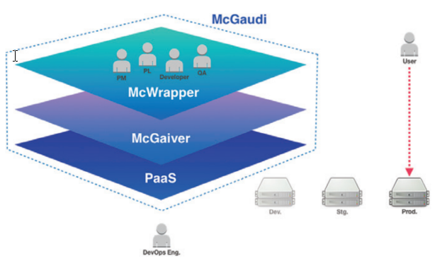

# MC Wrapper 2.x Manual
Megazone Cloud DevOps팀에서 개발한 솔루션인 MC Wrapper 2.x의 매뉴얼을 작성하기 위한 저장소입니다.

# 제품 소개

McGaudi는 업무 프로세스와 도구 등을 DevOps 관점에서
최적의 조건으로 구성하여 자동화 처리하고, 개발 업무 결재 관리에
대한 부분을 통합적으로 다룸으로써 빠른 개발/빠른 출시를 위한
최적의 솔루션입니다.

DevOps는 하나의 큰 문화이면서, 개발관련 업무 프로세스, 방법론, 도구 등에 관련한 전체의 틀 역할로써 시장의 빠른 변화를 따라가기
위한 최선의 전략 입니다. 따라서 DevOps는 모범사례(Best Practice)를 기반으로 다양한 시도를 통한 최적의 업무프로세스를
구축하고, 관련한 도구를 구성하여 자동화된 시스템을 기반으로 개발 문화를 새롭게 하는 것에 필수적인 요소 입니다.

### 엔터프라이즈 서비스 애플리케이션의 개발 및 검증/배포를 사용자 관점에서 쉽게

체계화된 업무 프로세스를 CI/CD pipeline과 연동하여, 개발 요청부터 배포까지 전체 업무를 하나의 과정으로 관리
Well-made CI/CD pipeline template을 통해 간단한정보 입력만으로도 프로젝트별 업무 프로세스를쉽게생성 및 관리
잘 정리된 업무 프로세스를 기반으로 DevOps 문화와 기술 습득에 도움을 줍니다.

### McGaudi와 함께라면?

- 빠르고 간소화된 결재 프로세스 및 시스템 제공
- CI/CD를 위한 단일화된 화면 제공
- 다양한 관점(개발요청/개발/빌드/검증/배포)의 자동화된 흐름의 시각화
- 모바일 서비스 환경을 기반으로 편리한 Remote office & work가 가능
- QA 자동화를 위한 기반 프로세스 제공
- DevOps 문화 도입을 위한 손쉬운 접근

> **개발 요청에서 처리까지 소요되는 시간**
>
> 

### McGaudi Life Cycle

비즈니스의 요구사항을 단일화된 채널을 통해 처리 할 수 있으므로, 개발 업무 진행에 따른 시스템 구성 등을 시각적으로 확인 할 수 있습니다. 또한, 자동화 처리된 빌드/검수 환경 제공 등을 통해 신속한 검수 및 서비스 반영이 가능하도록 모든 과정을 한 곳에서 관리합니다.

### McWrapper?

McWrapper는 사용자에게 개발 업무 결재 프로 세스를 확인 및 요청/처리 등을 하는 창구 역할을 합니다. 이 해당 창구를 통해 McGaiver의 CI/CD Pipeline를 기반으로 개발/배포 시스템을 자동으로 처리 합니다.
