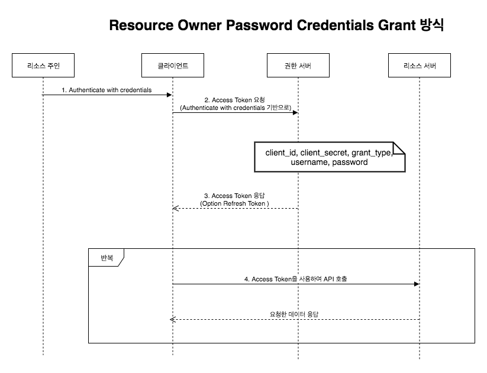

# Summary

- 제품의 특장점

  - 모바일 서비스 환경을 기반으로 편리한 Remote office & work가 가능
  - 빠르고 간소화된 결재 프로세스 및 시스템
  - QA 자동화
  - 다양한 관점(개발요청/개발/빌드/검증/배포)의 시각화 제공
  - DevOps 문화를 이해 할 수 있도록 다양한 연동을 위한 API 및 도구로 확장(Pivotal application Service, Pivotal Tracker, Jira, Concourse, Google Drive, Git, Docker-registry, Nexus, Jenkins, SonarQube, Code-coverage 등)

- Workflow
  

# Installation

## MSA(MicroService Architecture) Version

### Architecture

#### 구성 서비스

- Config server

  마이크로 서비스 어플리케이션들이 각 환경별로 참조하는 어플리케이션 설정 정보들을 관리하는 서비스

  > **Runtime Options**
  >
  > - 공통
  >
  >   -Dserver.port=[서비스 포트]
  >
  > - 설정파일 저장소로 파일 시스템을 이용하는 경우
  >
  >   - -Dspring.profiles.active=native
  >     설정 파일 저장소로 GIT을 이용할 때는 이 option을 지정하지 않고, 설정 파일 저장소로 파일 시스템을 이용할 경우에는 native로 설정한다.
  >   - -DdevopsApConfigPath=[설정 파일 저장소 파일시스템 경로]
  >     spring.profiles.active=native 인 경우 설치 패키지에 포함된 기존 설정 파일이 저장된 파일시스템 경로를 지정한다.
  >   - -DdevopsApSiteConfigPath=[사이트 설정 파일 저장소 파일시스템 경로]
  >     spring.profiles.active=native 인 경우 사이트에 의존적인 설정들을 override 하기 위한 신규 설정 파일이 저장된 파일시스템 경로를 지정한다.
  >
  > - 설정파일 저장소로 GIT을 이용하는 경우
  >
  >   -Dspring.cloud.config.server.git.uri=[설정 파일 저장소 GIT 경로]
  >   spring.profiles.active를 지정하지 않은 경우 설정 파일이 저장된 GIT 경로를 지정한다.
  >
  >   GIT 저장소를 이용하는 경우 인증 처리를 위해 다음과 같이 반영해야 한다.
  >
  >   - 로컬에 인증키를 설치하는 경우
  >
  >     1.  어플리케이션 실행 계정에 GIT 접속 ssh 키를 추가한다.
  >     2.  unknown host 에러를 피하기 위해 {home}/.ssh/known_hosts에 GIT 도메인을 추가한다.
  >
  >   - ID/PW로 접속하는 경우
  >
  >     아래의 runtime options를 추가한다.
  >
  >     - -Dspring.cloud.config.server.git.username=[사용자ID]
  >     - -Dspring.cloud.config.server.git.password=[사용자 패스워드]
  >
  >   - 인증키로 접속하는 경우
  >
  >     아래의 runtime options를 추가한다.
  >
  >     - -Dspring.cloud.config.server.git.ignoreLocalSshSettings=true
  >     - -Dspring.cloud.config.server.git.hostKey=[호스트키]
  >     - -Dspring.cloud.config.server.git.hostKeyAlgorithm=ssh-rsa
  >     - -Dspring.cloud.config.server.git.privateKey=[ssh 프라이빗 키]

- Gateway

  마이크로서비스들의 단일 endpoint를 제공하는 router 서비스

  > **Runtime Options**
  >
  > - -Dserver.port=[서비스 포트]
  > - -Dspring.cloud.config.uri=[Config server 서비스 URI]
  > - -Dspring.cloud.config.headers.application-password=[Config server의 접속 패스워드]
  >
  >   설치 환경별 중요 민감 정보를 보호하기 위해 Config server의 접속 패스워드를 변경하는 경우 마이크로 서비스별 접속 패스워드를 Config server의 설정 정보와 일치시켜야 한다.
  >
  > - -Dspring.profiles.active=[각 설치 타입과 환경별 프로파일명]
  >
  >   패키지 설치 시에는 application-site.yml 파일을 각 사이트별로 신규 생성하여 사이트에 의존적인 설정을 override 한다.
  >
  > - 패키지 설치 시: package,site
  > - 각 환경별 설치 시: dev / stg / prd 등

- Users

  사용자 관리 및 로그인 등의 기능을 제공하는 공통 서비스

  > **Runtime Options**
  >
  > Gateway와 동일

- Comments

  댓글 기능을 제공하는 공통 서비스

  > **Runtime Options**
  >
  > Gateway와 동일

- Notifications

  알림 기능을 제공하는 공통 서비스

  > **Runtime Options**
  >
  > Gateway와 동일

- Airplane

  Wrapper-if와 연동하여 CI Tool의 API를 Wrapping 하는 서비스

- Wrapper-app

  McWrapper의 UI 서비스

  Static Web

- Wrapper-md

  core API를 재조합하여 McWrapper의 view model을 제공하는 API 서비스

  > **Runtime Options**
  >
  > Gateway와 동일

- Wrapper-if

  McWrapper의 외부 인터페이스를 담당하는 API 서비스

  > **Runtime Options**
  >
  > Gateway와 동일

### 서비스 우선순위

> Config server > Gateway = Users = Comments = Notifications = Wrapper-app = Wrapper-md = Wrapper-if

## Monolithic Version

### Architecture

### 설정

Monolithic version의 경우 MSA Version과는 다르게 설정 서버가 별도로 존재하지 않습니다. 기본 설정은 Container Image 내부 application.yml 파일의 내용이 적용됩니다. 기본 설정을 변경하려는 경우 runtime option을 이용하여 변경이 가능합니다. 더 자세한 설명은 [스프링부트 가이드](https://docs.spring.io/spring-boot/docs/current/reference/html/boot-features-external-config.html)를 참조하세요.

> **Runtime Option**
>
> -Dspring.config.location=./conf/application.yml

# 모니터링

> 지원예정

# 모니터링

## 로그

> **로그 경로 설정**
>
> 설정 파일(application.yml)의 logging.path에 설정합니다. 자세한 설정 방법은 [스프링부트 가이드](https://docs.spring.io/spring-boot/docs/current/reference/html/boot-features-logging.html)를 참조하세요.

# 장애 대응

# Oauth 2.0 Login 설정

## OAuth2 승인 방식의 종류

- Authorization Code Grant Type: 권한 부여 코드 승인 타입

  클라이언트가 다른 사용자 대신 특정 리소스에 접근을 요청할 때 사용됩니다. 리스소 접근을 위한 사용자 명과 비밀번호, 권한 서버에 요청해서 받은 권한 코드를 함께 활용하여 리소스에 대한 엑세스 토큰을 받는 방식입니다.

  

  1. 클라이언트가 파리미터, 클라이언트 ID, 리다이렉트 URI, 응답 타입을 code로 지정하여 권한 서버에 전달합니다. 정상적으로 인증이 되면 권한 코드 부여 코드를 클라이언트에게 보냅니다.
     응답 타입은 code, token 이 사용 가능합니다.
     응답 타입이 token 일 경우 암시적 승인 타입에 해당합니다.
  1. 성공적으로 권한 부여 코드를 받은 클라이언트는 권한 부여 코드를 사용하여 엑세스 토큰을 권한 서버에 추가로 요청합니다. 이때 필요한 파라미터는 클라이언트 ID, 클라이언트 비밀번호, 리다이렉트 URI, 인증 타입 입니다.
  1. 마지막으로 받은 엑세스 토큰을 사용하여 리소스 서버에 사용자의 데이터를 보냅니다.

- Implicit Grant Type: 암시적 승인

  권한 부여 코드 승인 타입과 다르게 권한 코드 교환 단계 없이 엑세스 토큰을 즉시 반환받아 이를 인증에 이용하는 방식입니다.

  

  - (1) 클라이언트가 파리미터, 클라이언트 ID, 리다이렉트 URI, 응답 타입을 code로 지정하여 권한 서버에 전달합니다. 정상적으로 인증이 되면 권한 코드 부여 코드를 클라이언트에게 보냅니다.
    응답 타입은 code, token 이 사용 가능합니다.
    응답 타입이 token 일 경우 암시적 승인 타입에 해당합니다.
  - (2) 응답 해준 Access Token 이 유효한지 검증 요청을 합니다.
  - (3) 요청 받은 Access Token 정보에 대한 검증에 대한 응답값을 돌려줍니다.
  - (4) 유효한 Access Token 기반으로 Resource Server와 통신합니다.

- Resource Owner Password Credentials Grant Type: 리소스 소유자 암호 자격 증명 타입

  클라이언트가 암호를 사용하여 엑세스 토큰에 대한 사용자의 자격 증명을 교환하는 때입니다.

  

  - (1) 인증을 진행합니다. 대부분 ID, Password를 통해서 자격 증명이 진행됩니다.
  - (2) 넘겨 받은 정보기반으로 권한 서버에 Access Token 정보를 요청합니다.
  - (3) Access Token 정보를 응답 받습니다. 이때 Refresh Token 정보도 넘겨 줄 수도 있습니다.
  - (4) Access Token 기반으로 Resource Server와 통신합니다.

- Client Credentials Grant Type: 클라이언트 자격 증명 타입

  클라이언트가 컨텍스트 외부에서 액세스 토큰을 얻어 특정 리소스에 접근을 요청할 때 사용하는 방식입니다.

  

  - (1) Access Token 정보를 요청합니다.
  - (3) Access Token 정보를 응답합니다. 이때 Refresh Token 정보는 응답하지 않는 것을 권장합니다. 별다른 인증 절차가 없기 때문에 Refresh Token 까지 넘기지 않는 것이라고 생각합니다.
  - (4) Access Token 기반으로 Resource Server와 통신합니다.

## Google

> [Google Cloud Platform Console](https://console.developers.google.com/apis/dashboard)

## Naver

> [Naver Developers](https://developers.naver.com/apps/#/myapps)

## Kakao

> [Kakao Developers](https://developers.kakao.com/apps)

## GitHub

> [Github Settings](https://github.com/settings/developers)

## Facebook
