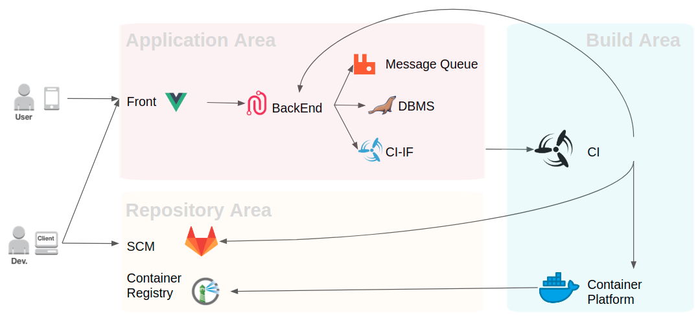
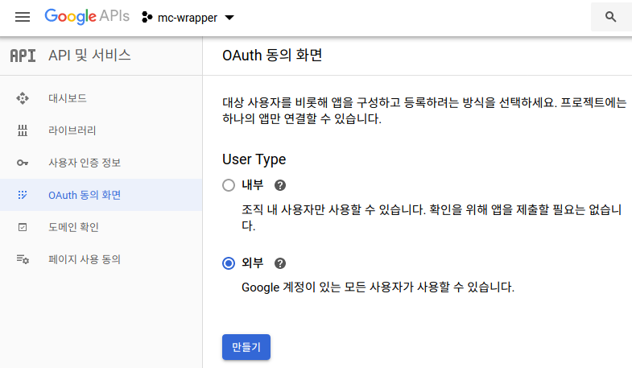
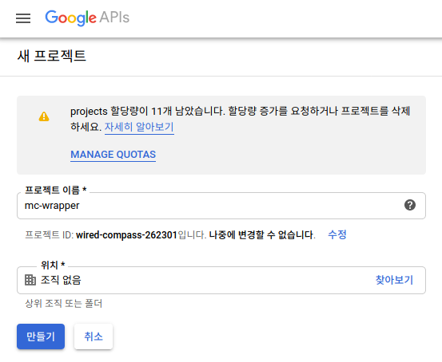
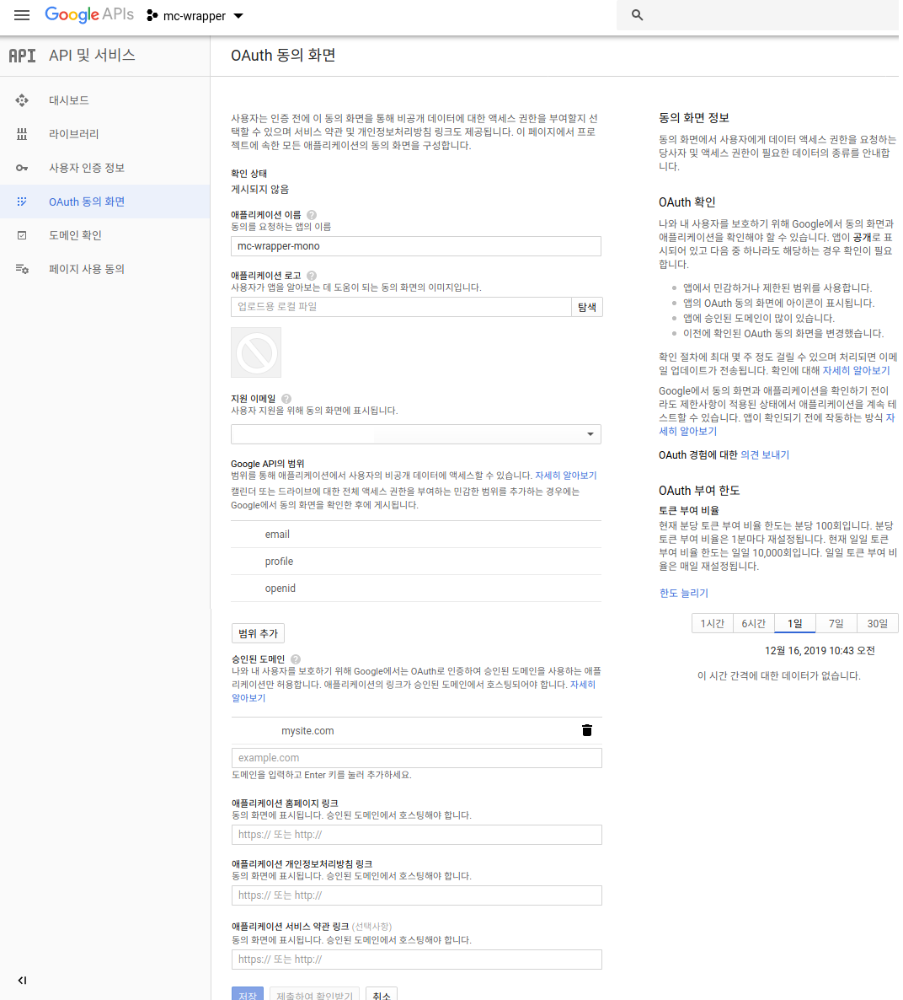
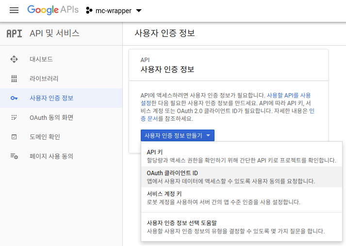
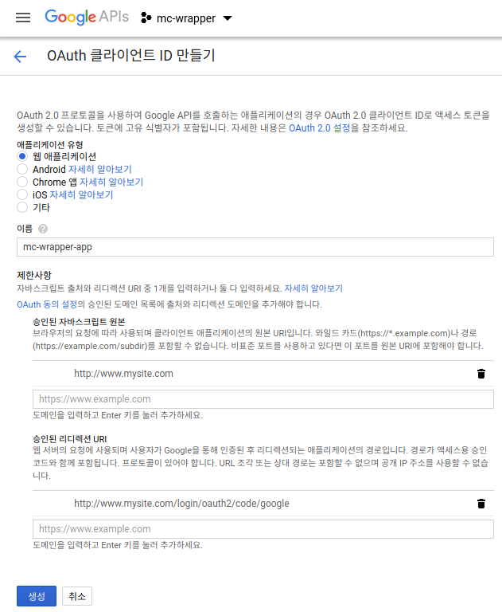
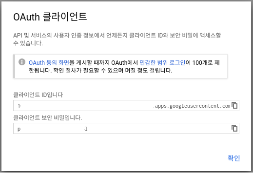

# Summary

- 본 문서의 목적은 설치형 라이센스로 McWrapper 를 고객사에 설치하고, 이후 McWrapper 관리를 위하여 관리자가 숙지해야 할 내용을 가이드 하는 것에 그 목적이 있다.


# Installation

### - 서버 요구사항

| 구분    | 최소요구 사항 | 권장 사항   |
| ------  | -------      |------ |
| OS      | Docker Container 운영 가능한 64bit OS  | Ubuntu 16 64bit 이상의 LTS 버전 |
| CPU     | 2Core / 2Ghz                        | 4Core / 4Ghz (가상화 지원)|
| 저장장치 | 8GB RAM / 20GB HDD               | 16GB RAM / 100GB HDD |
| 네트워크 카드 | 100M | 기가비트 지원 네트워크 카드|

### - 클라이언트 요구사항
| 구분    | 최소요구 사항 | 권장 사항   |
| ------  | -------      |------ |
| 브라우져   IE 11 이상 | Chrome 78.xx 이상 |
| 해상도 | 모바일 기기 해상도에 최적화 |


# 시스템 구성도



## Application Area
McWrapper 어플리케이션과 관련된 모듈들이 구동되는 영역을 의미한다.
- Front - McWrapper 화면 구성 및 GUI 처리 담당
  > **${MC_WRAPPER_PACKAGE_INSTALL_PATH}/docker-compose.yml**
  >```
  > mc-wrapper-vue:
  >  image: dockerregistry.kr/mc_wrapper/wrapper-app-vue:1.0.0-RELEASE
  >  container_name: mc-wrapper-app-vue
  >  ports:
  >    - "80:80"
  > ```
  > - image: Docker Registry에 저장되어 있는 지정된 Front 용 Image 이름과 Tag 이름을 작성한다.
  > - port: 클라이언트에서 브라우져를 사용하여 접근할 포트 번호를 지정한다.

- BackEnd - Front 에서 호출하는 API 처리 담당
  > **${MC_WRAPPER_PACKAGE_INSTALL_PATH}/docker-compose.yml**
  >```
  >mc-wrapper-md-monolithic:
  >  image: dockerregistry.kr/mc_wrapper/54-mon:1.3.0-RELEASE
  >  container_name: mc-wrapper-md-monolithic
  >  ports:
  >    - "8080:8080"
  >  environment:
  >    - JAVA_OPTS=-Dserver.port=8080
  >  volumes:
  >    - ./config:/app/config
  >  restart: always
  >```
  > - image: Docker Registry 에 저장되어 있는 지정된 BackEnd 용 Image 이름과 Tag 이름을 작성한다.
  > - port: BackEnd API 호출 시 사용할 포트 번호를 지정한다.
  > - environment: 어플리케이션 기동 시 전달할 JAVA 환경변수를 지정한다.
  > - volumes: 어플리케이션에서 사용할 Config 파일 경로를 지정한다.

- DBMS - 비 휘발성 데이터 저장을 위한 영역으로, 사용자의 니즈에 맞추어 별도 MariaDB (MySQL) 호환 DBMS 서버도 사용 가능 (Option)
  > **${MC_WRAPPER_PACKAGE_INSTALL_PATH}/docker-compose.yml**
  > ```
  >  mariadb:
  >  image: mariadb:10.2.15
  >  container_name: mariadb
  >  ports:
  >    - "3306:3306"
  >  volumes:
  >   - ./mariadb:/var/lib/mysql
  >  environment:
  >    - MYSQL_ROOT_PASSWORD=password
  >    - MYSQL_USER=user
  >    - MYSQL_PASSWORD=password
  > ```
  > - image: Docker Registry에 저장되어 있는 지정된 Mariadb Image 이름과 Tag 이름을 작성한다.
  > - port: BackEnd에서 DBMS 연결시 사용할 포트 번호를 지정한다.
  > - volumes: Docker Container 중지시에도 저장된 데이터를 유지키시기 위하여 local 경로를 지정한다.
  > - environment: mariadb 관리자 계정 정보를 지정한다.

- MessageQueue - 어플리케이션 간 메세지 전달
  > **${MC_WRAPPER_PACKAGE_INSTALL_PATH}/docker-compose.yml**
  > ```
  > rabbitmq:
  >  image: rabbitmq:management
  >  container_name: rabbitmq
  >  environment:
  >    - RABBITMQ_DEFAULT_USER=admin
  >    - RABBITMQ_DEFAULT_PASS=패스워드
  >    - RABBITMQ_DEFAULT_VHOST=my_vhost
  >  ports:
  >    - "9999:15672"
  >  volumes:
  >   - ./rabbitmq/db:/var/lib/rabbitmq/mnesia
  > ```
  > - image: Docker Registry 에 저장되어 있는 지정된 Rabbitmq Image 이름과 Tag 이름을 작성한다.
  > - port: BackEnd 에서 Rabbitmq 연결 시 사용할 포트 번호를 지정한다.
  > - volumes: Docker Container 중지시에도 저장된 데이터를 유지키시기 위하여 local 경로를 지정한다.
  > - environment: Rabbitmq의 계정 정보 및 VHOST 정보를 지정하고, 해당 정보는 "mc-wrapper-md-monolithic" 의 applicaiton.yml 과 연동된다.

- CI Interface - 지정된 CI Tool 인터페이스 모듈
  > **${MC_WRAPPER_PACKAGE_INSTALL_PATH}/docker-compose.yml**
  >
  > ```
  >concourse-airplane:
  >  image: dockerregistry.kr/mc_wrapper/concourse_airplane:1.1.0-RELEASE
  >  container_name: concourse-airplane
  >  environment:
  >    - CONCOURSE_WEB_SERVER=http://HOST_NAME:80
  >    - AIRPLANE_USER=admin
  >    - AIRPLANE_PASSWORD=패스워드
  >    - PORT=8090
  >  ports:
  >    - "8090:8090"
  > ```
  > - image: Docker Registry에 저장되어 있는 지정된 CI Tool 용 Image 이름과 Tag 이름을 작성한다.
  > - port: Application 및 CI Tool에서 해당 모듈과 통신 시 사용할 포트 번호를 지정한다.
  > - environment: CI Tool에 접근하기 위한 접속 정보와 CI Interface 모듈의 환경 정보를 작성한다.

## Repository Area
소스코드 및 빌드 결과물인 Image를 저장하는 모듈들이 구동되는 영역이다.
- SCM - 개발자가 작성한 소스코드를 저장하는 영역으로 사용자에서 운영중인 환경이 있다면 사용가능하다. (Option). 아래는 Docker Image를 사용한 GitLab 환경 구성 예시를 설명한다.
  > **Runtime Options**
  >
  > 설정이 필요한 내용을 작성해주세요.

- Container Registry - CI/CD Tool에서 생성한 Container Image를 저장하는 영역으로 고객사에서 사용중인 환경이 있다면 해당 환경을 사용가능하다. (Option). 아래는 Docker Image 를 사용한 Harbor 환경 구성 예시를 설명한다.
  > **Runtime Options**
  >
  > 설정이 필요한 내용을 작성해주세요.

## Build Area
파이프 라인을 관리 및 개발된 소스코드를 빌드, Image 생성 모듈들이 구동되는 영역이다.
- CI/CD Tool - CI/CD를 위한 Tool을 구성하는 영역으로 고객사에서 사용중인 환경이 있다면 해당 환경을 사용가능하다. (Option). 아래는 Docker Image를 사용한 Concourse 환경 구성 예시를 설명한다.
  > **Runtime Options**
  >
  > 설정이 필요한 내용을 작성해주세요.

- Container Platform - CI/CD Tool에서 빌드가 완료된 Artifact를 Container Image로 생성하는 작업을 수행한다. 아래는 Docker Image를 생성하기 위한 설치 패키지 예시를 작성한다.
  > **Runtime Options**
  >
  > 설정이 필요한 내용을 작성해주세요.

# 어플리케이션 기동과 종료

## Application Area

  > **기동 절차**
  >
  > $cd ${MC_WRAPPER_PACKAGE_INSTALL_PATH}
  > $docker-compose up -d

  > **종료 절차**
  >
  > $cd ${MC_WRAPPER_PACKAGE_INSTALL_PATH}
  > $docker-compose down

## Repository Area
  > **기동 절차**
  >
  > 레파지토리 영역의 기동 절차를 작성해주세요.

  > **종료 절차**
  >
  > 레파지토리 영역의 종료 절차를 작성해주세요.

## Build Area
  > **기동 절차**
  >
  > 빌드 영역의 기동 절차를 작성해주세요.

  > **종료 절차**
  >
  > 빌드 영역의 종료 절차를 작성해주세요.

# 어플리케이션 환경설정

## mc-wrapper-md-monolithic
McWrapper Backend Application 의 주요 환경설정 정보를 설명한다.

  > **${MC_WRAPPER_INSTALL_PATH}/config/application.yml**
  >```yml
  > application:
  >   #현재 Backend 어플리케이션에 사용하고 있는 domain 정보로 로그인 세션 및 라이센스 정책과 관련된 설정으로 일반 사용자의 수정은 권장하지 않는다.
  >   representation-domain: domain_name.kr
  >
  > spring:
  > ## Datasource 접속정보로 어플리케이션에서 사용할 DBMS 접근 정보를 지정한다.
  >   datasource:
  >     url: "jdbc://지정된 DBMS 의 Conneciton String"
  >     username: "아이디"
  >     password: "패스워드"
  >
  > ## Oauth2 클라이언트 설정으로 google 인증서버를 기본으로 사용하며 클라이언트 아이디 발급 방법은 "별첨" 을 참고한다.
  >   security:
  >     oauth2:
  >       client:
  >         registration:
  >           google:
  >             client-id: "생성된 구글 클라이언트 아이디"
  >             client-secret: "구글 클라이언트 인증키"
  > ## 어플리케이션에서 메일을 발송하기 위한 메일서버 정보를 설정한다.
  >   mail:
  >     host: "SMTP 서버 주소"
  >     port: 587 (SMTP 포트번호)
  >     username: "devops_support@mz.co.kr"
  >     password: "password"
  >     properties:
  >       mail:
  >         smtp: (SMTP 서버 타입에 따른 인증 규칙 설정)
  >           auth: true
  >           starttls.enable: false
  >
  > ## 어플리케이션 Logging 설정으로 로그파일 저장경로 및 로깅패턴, 로그레벨 등을 지정한다.
  > ## 자세한 설정 방법은 아래 URL 을 참고
  > ## https://docs.spring.io/spring-boot/docs/current/reference/html/boot-features-logging.html
  > logging:
  >   path: /tmp/mc_wrapper
  >   file:
  >     max-size: 30MB
  >     max-history: 10
  >   pattern:
  >     console: '%d{MM/dd HH:mm:ss.SSS} [%t] [%clr(%-5p)] %clr(%logger.%M\(%line\)){cyan} - %msg %n'
  >     file: '%d{MM/dd HH:mm:ss.SSS} [%t] [%clr(%-5p)] %clr(%logger.%M\(%line\)){cyan} - %msg %n'
  >   level:
  >     root: info
  >     #해당 설정은 안정화 및 이슈추적 시에만 사용하고 그외에는 주석처리 하는 것을 권장한다.
  >     #com.megazone.devops: debug
  >
  > ## McWrapepr 커스터 마이징 설정
  > mz:
  >   # Mc-Wrapper 서비스별 호출 URL정보를 지정한다.
  >   micro-service:
  >     service:
  >       devops-gateway: "https://mc-wrapper.url"
  >       devops-wrapper-md: "https://mc-wrapper.url"
  >       devops-wrapper-if: "https://mc-wrapper.url"
  >       devops-notification: "https://mc-wrapper.url"
  >       devops-users: "https://mc-wrapper.url"
  >       devops-comment: "https://mc-wrapper.url"
  >       devops-comment-ui: "https://mc-wrapper.url"
  >       devops-airplane: "https://airplane.url"
  >   # Mc-Wrapper 서비스별 트랜잭션 처리를 위한 MQ 호출정보를 지정한다.
  >   global-transaction:
  >     listeners:
  >       addresses: "MQ_호스트명:5672"
  >       username: "MQ_아이디"
  >       password: "MQ_패스워드"
  >       vhost: "V_HOST_명"
  >       uris: "amqp://MQ_아이디:MQ_패스워드@MQ_호스트명:5672/V_HOST_명"
  >   # 어플리케이션 데이터 암호화를 위한 설정
  >   security:
  >     encryption:
  >       key:
  >         # 단방향 암호화 키
  >         oneway: '16자리공백을 제외한 Ascii 문자열'
  >         # 대칭키 암호화 키
  >         symmetric: '16자리공백을 제외한 Ascii 문자열'
  >         # 내부 인터페이스 암호화 키
  >         innerInterface: '16자리공백을 제외한 Ascii 문자열'
  >   wrapper:
  >     # Mc-Wrapper 에서 릴리즈 티켓 생성시 생성되는 개발,테스트,운영 서버의 접근 정보를 지정한다.
  >     delevery-domain:
  >       # 프로토콜 정보
  >       protocol: "https://"
  >       #
  >       dev: ".dev.site.kr"
  >       stg: ".stg.site.kr"
  >       prd: ".prd.site.kr"
  >     invite:
  >       url: "http://front.application.kr:8090/sign-in"
  >   notifications:
  >     batch:
  >       interval: 60
  >     mail:
  >       from: "devops_solution@mz.co.kr"
  >```

## 그외 환경설정 파일이 존재하는 어플리케이션

  > **설정파일 경로**
  >
  > 설정에 대한 설명을 기술


# 데이터 백업
> 지원예정

# 모니터링
> 지원예정

# 장애대응
> 지원예정

# 별첨

## SSH Key 등록

파이프라인 변수 중에는 git private key를 등록해야 할 경우가 있으며 만약, SSH Key가 없다면 새로운 SSH 키 페어를 생성해야한다.

### SSH Key 생성

Terminal를 실행하여 SSH Keyh를 만들어본다.

먼저, SSH Key를 생성하기 전에 이미 생성된 Key가 있는지 확인한다.

```ssh
cd ~/.ssh
No such file or directory
```

아직 한번도 SSH key를 생성하지 않은 상태이다.

새로운 SSH Key pair를 만들어본다.

- ED25519

  ```ssh
  ssh-keygen -t ed25519 -C "email@example.com"
  ```

- RSA
  ```ssh
  ssh-keygen -o -t rsa -b 4096 -C "email@example.com"
  ```

이 -C flag는 Key가 여러 개이고, 선택이 필요한 경우 Key에 주석을 추가한다.  (옵션 사항)

```ssh
Enter file in which to save the key (/Users/사용자이름/.ssh/id_ed25519):
Created directory '/Users/사용자이름/.ssh'.
```

어디에 key를 만들지 묻고, 여기에서는 엔터를 처서 기본 위치에 기본 파일명으로 만들도록한다.

```ssh
Enter passphrase (empty for no passphrase):
Enter same passphrase again:
```

Key에 대한 비밀번호를 만들라고 나오는데 여기에서는 엔터를 처서 넘어간다.

그럼 키가 만들어지고 기본 위치(/Users/사용자이름/.ssh/id_ed25519)에 파일이 생성된다.

이제 생성이 되어 있는지 확인한다.

```ssh
cd ~/.ssh
```

id_ed25519 id_ed25519.pub가 생성되어 있는 것을 확인할 수 있다.

### SSH Key 등록

운영 체제에 따라 아래 명령 중 하나를 사용 하여 공개 SSH 키를 클립 보드에 복사한다.

```
맥 OS:
pbcopy < ~/.ssh/id_ed25519.pub
```

```
WSL / GNU / Linux (xclip 패키지 필요):
xclip -sel clip < ~/.ssh/id_ed25519.pub
```

```
Windows의 Git Bash:
cat ~/.ssh/id_ed25519.pub | clip
```

그래픽 편집기에서 키를 열고 여기에서 복사 할 수도 있지만 실수로 아무 것도 변경하지 않도록 주의해야한다.

에디터에 ctrl + v 하면 복사된 private key 값이 나온다.


복사된 키를 사용자 계정에 등록한다.

### 참조

보다 자세한 내용은 아래의 페이지들을 참조할 수 있도록 한다.

- Git-SCM: <https://git-scm.com/book/ko/v1/Git-%EC%84%9C%EB%B2%84-SSH-%EA%B3%B5%EA%B0%9C%ED%82%A4-%EB%A7%8C%EB%93%A4%EA%B8%B0>
- GitLab: <https://docs.gitlab.com/ee/ssh/>
- GitHub: <https://help.github.com/en/github/authenticating-to-github/connecting-to-github-with-ssh>


## Oauth 2.0 Login 설정

McWrapper 에서는 사용자 인증을 위하여 Oauth2 를 지원하며 google, naver, kakao, github 에서 제공하는 oauth2 인증 서비스를 등록가능하다. 본 별첨 부록에서는 google 에서 지원하는 oauth2 클라이언트 등록방법 만을 가이드 하며, 다른 인증 서비스들도 해당 가이드와 유사한 절차를 따른다.

### Google Oauth2 인증 설정

1. McWrapper 에서 사용할 관리자 계정으로 google api console 서비스에 로그인한다.
   ```
   https://console.developers.google.com/
   ```

2. Google Api 서비스에서 OAuth 동의 화면 메뉴를 선택하고, User Type 은 외부를 선택후 [만들기] 버튼을 클릭한다.
   

3. Google Api 서비스에서 프로젝트를 생성한다. 기 생성된 프로젝트가 존재한다면 해당 프로젝트를 사용해도 무방하다.
   

4. "OAuth 동의 화면" 메뉴에서 "애플리케이션 이름" 과 "승인된 도메인" 항목을 작성 후 [저장] 버튼을 클릭한다.
   ```
   "승인된 도메인" 항목은 McWrapper 의 Backend Application 에 할당된 도메인 정보를 입력해야한다.
   ```
   

5. Google Api 서비스에서 "사용자 인증 정보" 메뉴를 선택 후 [사용자 인증 정보 만들기] 버튼을 클릭하여 팝업된 리스트 중 "OAuth 클라이언트 ID" 를 선택한다.
   

6. "OAuth 클라이언트 ID 만들기" 화면에서 "애플리케이션 유형" 은 "웹 애플리케이션" 을 선택하고, "이름", "승인된 자바스크립트 원본", "승인된 디다렉션 URI" 항목을 작성후 [생성] 버튼을 클릭한다.
   ```
   "승인된 자바스크립트 원본" 항목은 McWrapper 의 Backend Application 에 할당된 도메인 정보를 입력한다.
   "승인된 디다렉션 URI" 항목은 McWrapper Backend Application 에 할당된 도메인 정보 뒤에 "/login/oauth2/code/google" 을 추가해서 입력한다.
   ```
   

7. 최종 생성된 OAuth 클라이언트 정보 "클라이언트 ID" 와 "클라이언트 보안 비밀키" 를 지정된 환경설정 파일에 작성한다.
   
