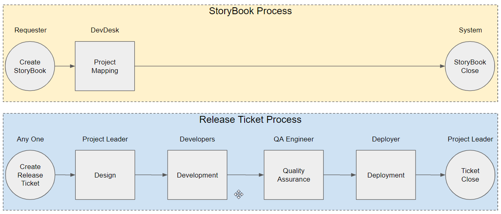
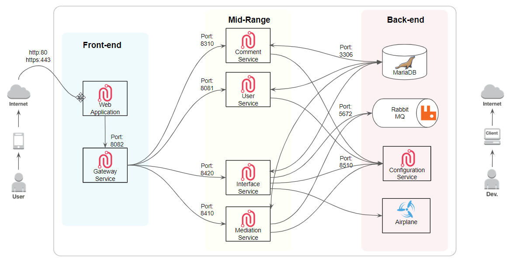
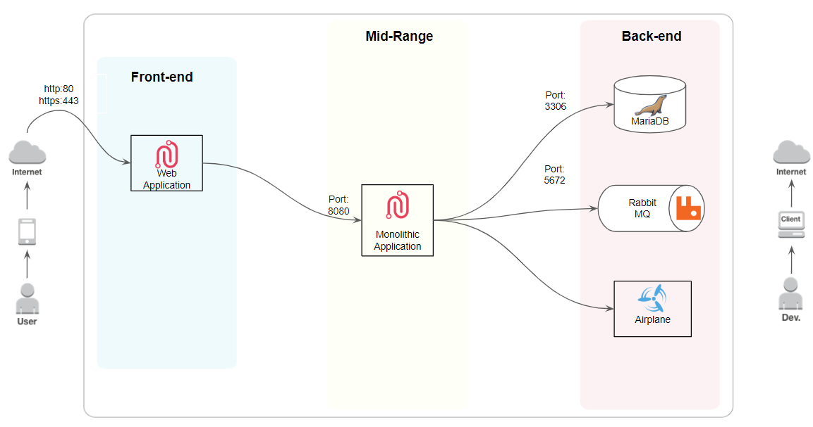

# Summary

- 제품의 특장점

  - 모바일 서비스 환경을 기반으로 편리한 Remote office & work가 가능
  - 빠르고 간소화된 결재 프로세스 및 시스템
  - QA 자동화
  - 다양한 관점(개발요청/개발/빌드/검증/배포)의 시각화 제공
  - DevOps 문화를 이해 할 수 있도록 다양한 연동을 위한 API 및 도구로 확장(Pivotal application Service, Pivotal Tracker, Jira, Concourse, Google Drive, Git, Docker-registry, Nexus, Jenkins, SonarQube, Code-coverage 등)

- Workflow
  

# Installation

## MSA(Micro Service Application) Version

### Architecture

#### 구성 서비스

- Config server

  > 마이크로 서비스 어플리케이션들이 각 환경별로 참조하는 어플리케이션 설정 정보들을 관리하는 서비스

  - runtime options

    - 공통
      > -Dserver.port=[서비스 포트]
    - 설정파일 저장소로 파일 시스템을 이용하는 경우

      > - -Dspring.profiles.active=native
      >   설정 파일 저장소로 GIT을 이용할 때는 이 option을 지정하지 않고, 설정 파일 저장소로 파일 시스템을 이용할 경우에는 native로 설정한다.
      > - -DdevopsApConfigPath=[설정 파일 저장소 파일시스템 경로]
      >   spring.profiles.active=native 인 경우 설치 패키지에 포함된 기존 설정 파일이 저장된 파일시스템 경로를 지정한다.
      > - -DdevopsApSiteConfigPath=[사이트 설정 파일 저장소 파일시스템 경로]
      >   spring.profiles.active=native 인 경우 사이트에 의존적인 설정들을 override 하기 위한 신규 설정 파일이 저장된 파일시스템 경로를 지정한다.

    - 설정파일 저장소로 GIT을 이용하는 경우
      > -Dspring.cloud.config.server.git.uri=[설정 파일 저장소 GIT 경로]
      > spring.profiles.active를 지정하지 않은 경우 설정 파일이 저장된 GIT 경로를 지정한다.
      >
      > GIT 저장소를 이용하는 경우 인증 처리를 위해 다음과 같이 반영해야 한다.
      >
      > - 로컬에 인증키를 설치하는 경우
      >
      >   1.  어플리케이션 실행 계정에 GIT 접속 ssh 키를 추가한다.
      >   2.  unknown host 에러를 피하기 위해 {home}/.ssh/known_hosts에 GIT 도메인을 추가한다.
      >
      > - ID/PW로 접속하는 경우
      >
      >   아래의 runtime options를 추가한다.
      >
      >   - -Dspring.cloud.config.server.git.username=[사용자ID]
      >   - -Dspring.cloud.config.server.git.password=[사용자 패스워드]
      >
      > - 인증키로 접속하는 경우
      >
      >   아래의 runtime options를 추가한다.
      >
      >   - -Dspring.cloud.config.server.git.ignoreLocalSshSettings=true
      >   - -Dspring.cloud.config.server.git.hostKey=[호스트키]
      >   - -Dspring.cloud.config.server.git.hostKeyAlgorithm=ssh-rsa
      >   - -Dspring.cloud.config.server.git.privateKey=[ssh 프라이빗 키]

- Gateway

  > 마이크로서비스들의 단일 endpoint를 제공하는 router 서비스

  - runtime options

    - -Dserver.port=[서비스 포트]
    - -Dspring.cloud.config.uri=[Config server 서비스 URI]
    - -Dspring.cloud.config.headers.application-password=[Config server의 접속 패스워드]

      설치 환경별 중요 민감 정보를 보호하기 위해 Config server의 접속 패스워드를 변경하는 경우 마이크로 서비스별 접속 패스워드를 Config server의 설정 정보와 일치시켜야 한다.

    - -Dspring.profiles.active=[각 설치 타입과 환경별 프로파일명]

      패키지 설치 시에는 application-site.yml 파일을 각 사이트별로 신규 생성하여 사이트에 의존적인 설정을 override 한다.

      - 패키지 설치 시: package,site
      - 각 환경별 설치 시: dev / stg / prd 등

- Users

  > 사용자 관리 및 로그인 등의 기능을 제공하는 공통 서비스

  - runtime options: Gateway와 동일

- Comments

  > 댓글 기능을 제공하는 공통 서비스

  - runtime options: Gateway와 동일

- Notifications

  > 알림 기능을 제공하는 공통 서비스

  - runtime options: Gateway와 동일

- Airplane

  > Wrapper-if와 연동하여 CI Tool의 API를 Wrapping 하는 서비스

- Wrapper-app

  > McWrapper의 UI 서비스
  >
  > Static Web

- Wrapper-md

  > core API를 재조합하여 McWrapper의 view model을 제공하는 API 서비스

- Wrapper-if
  > McWrapper의 외부 인터페이스를 담당하는 API 서비스

### 서비스 우선순위

### 서비스 연관관계

### Database 초기화

## Monolithic Version

### Architecture

# 기본 설정

# 모니터링
