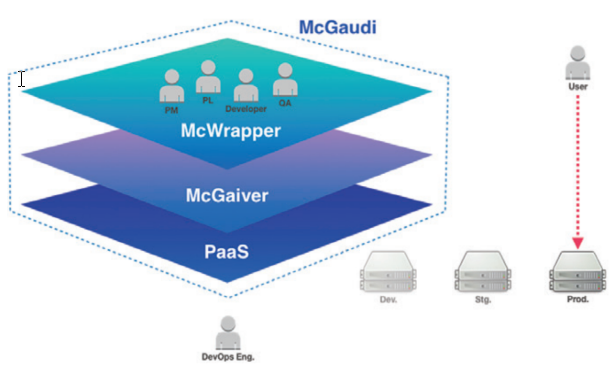
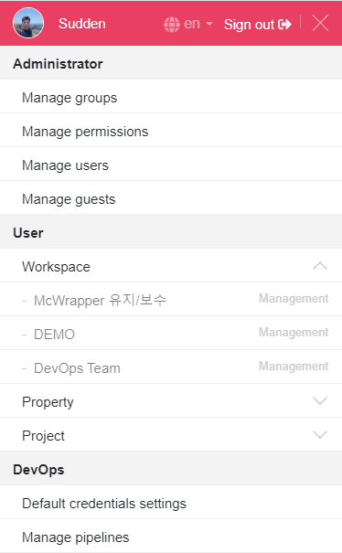

# 제품 소개

McGaudi는 업무 프로세스와 도구 등을 DevOps 관점에서
최적의 조건으로 구성하여 자동화 처리하고, 개발 업무 결재 관리에
대한 부분을 통합적으로 다룸으로써 빠른 개발/빠른 출시를 위한
최적의 솔루션입니다.

DevOps는 하나의 큰 문화이면서, 개발관련 업무 프로세스, 방법론, 도구 등에 관련한 전체의 틀 역할로써 시장의 빠른 변화를 따라가기
위한 최선의 전략 입니다. 따라서 DevOps는 모범사례(Best Practice)를 기반으로 다양한 시도를 통한 최적의 업무프로세스를
구축하고, 관련한 도구를 구성하여 자동화된 시스템을 기반으로 개발 문화를 새롭게 하는 것에 필수적인 요소 입니다.

### 엔터프라이즈 서비스 애플리케이션의 개발 및 검증/배포를 사용자 관점에서 쉽게

체계화된 업무 프로세스를 CI/CD pipeline과 연동하여, 개발 요청부터 배포까지 전체 업무를 하나의 과정으로 관리
Well-made CI/CD pipeline template을 통해 간단한정보 입력만으로도 프로젝트별 업무 프로세스를쉽게생성 및 관리
잘 정리된 업무 프로세스를 기반으로 DevOps 문화와 기술 습득에 도움을 줍니다.

### McGaudi와 함께라면?

- 빠르고 간소화된 결재 프로세스 및 시스템 제공
- CI/CD를 위한 단일화된 화면 제공
- 다양한 관점(개발요청/개발/빌드/검증/배포)의 자동화된 흐름의 시각화
- 모바일 서비스 환경을 기반으로 편리한 Remote office & work가 가능
- QA 자동화를 위한 기반 프로세스 제공
- DevOps 문화 도입을 위한 손쉬운 접근

> **개발 요청에서 처리까지 소요되는 시간**
>
> 

### McGaudi Life Cycle

비즈니스의 요구사항을 단일화된 채널을 통해 처리 할 수 있으므로, 개발 업무 진행에 따른 시스템 구성 등을 시각적으로 확인 할 수 있습니다. 또한, 자동화 처리된 빌드/검수 환경 제공 등을 통해 신속한 검수 및 서비스 반영이 가능하도록 모든 과정을 한 곳에서 관리합니다.

# 용어 설명

### 사용자

| 한국어 | English |
| ------ | ------- |
| 사용자 | User    |

McWrapper에 가입되어 사용하는 사람입니다.

### 로그인

| 한국어 | English |
| ------ | ------- |
| 로그인 | Sign In |

[사용자](#사용자) 계정 인증을 통해 사이트 이용을 시작합니다.

### 로그아웃

| 한국어   | English  |
| -------- | -------- |
| 로그아웃 | Sign Out |

[사용자](#사용자) 계정 정보를 통한 사이트 이용을 종료합니다.

### 그룹

| 한국어 | English |
| ------ | ------- |
| 그룹   | Group   |

[사용자](#사용자)들이 소속된 집단으로써, 특정 [사용자](#사용자)들을 일괄적으로 지정하기 위한 단위입니다.

### 워크스페이스

| 한국어       | English   |
| ------------ | --------- |
| 워크스페이스 | Workspace |

[프로퍼티](#프로퍼티)와 [프로젝트](#프로젝트)가 생성되는 공간으로써, 생성된 모든 콘텐츠는 워크스페이스 단위로 공유됩니다.

### 프로퍼티

| 한국어   | English  |
| -------- | -------- |
| 프로퍼티 | Property |

비즈니스적으로 구분되는 상품이나 자산의 최상의 단위로써, [스토리북](#스토리북)을 통해 업무 요건을 생성 및 관리할 수 있습니다. (ex. 검색, 지도, 카페, 블로그, etc.)

### 프로젝트

| 한국어   | English |
| -------- | ------- |
| 프로젝트 | Project |

개별적인 산출물을 생성하는 소프트웨어 개발의 단위이며, [릴리즈 티켓](#릴리즈 티켓)을 통해 개발 활동과 개발 주기를 관리할 수 있습니다.

### 구성원

| 한국어 | English |
| ------ | ------- |
| 구성원 | Member  |

[그룹](#그룹) 또는 [워크스페이스](#워크스페이스) 등에 소속된 구성원입니다.

### 빌드

| 한국어 | English |
| ------ | ------- |
| 빌드   | Build   |

소스 코드로부터 실행 가능한 소프트웨어로 만듭니다.

### 산출물

| 한국어 | English  |
| ------ | -------- |
| 산출물 | Artifact |

[빌드](#빌드) 된 결과물입니다.

### 요청자

| 한국어 | English   |
| ------ | --------- |
| 요청자 | Requester |

비즈니스 담당자(현업) 또는 Product Owner 등 개발이 필요한 사항들을 요청하는 사람입니다.

### PL

| 한국어 | English |
| ------ | ------- |
| PL     | PL      |

Project Leader. [프로젝트](#프로젝트) 내 개발을 Leading 하고, 설계하는 사람입니다.

### 검수 담당자

| 한국어      | English |
| ----------- | ------- |
| 검수 담당자 | QA      |

Quality Assurance. 개발된 [산출물](#산출물)의 품질 및 테스트를 관리하고 승인하는 역할입니다.

### 배포 담당자

| 한국어      | English  |
| ----------- | -------- |
| 배포 담당자 | Deployer |

검증된 소프트웨어를 실제 운영환경에 [배포](#배포)할지 결정하는 사람입니다.

### 릴리즈

| 한국어 | English |
| ------ | ------- |
| 릴리즈 | Release |

[프로젝트](#프로젝트)를 통해 개발된 소프트웨어 또는 서비스를 공개하는 단위입니다.

### 배포

| 한국어 | English |
| ------ | ------- |
| 배포   | Deploy  |

검증된 [산출물](#산출물)을 실제 운영환경에 반영합니다.

### 롤백

| 한국어 | English  |
| ------ | -------- |
| 롤백   | Rollback |

[배포](#배포)한 [산출물](#산출물)에 대하여 문제가 발생했을 경우 이전 버전으로 되돌리는 작업입니다.

### 업무

| 한국어 | English |
| ------ | ------- |
| 업무   | Task    |

전체 업무를 포괄하는 최상위 단위입니다.

### 티켓

| 한국어 | English |
| ------ | ------- |
| 티켓   | Ticket  |

업무 처리를 위해 요청사항을 담당자에게 전달하고 일련의 처리 과정을 기재하여 처리 과정과 결과를 조회할 수 있도록 정리한 게시물입니다.

### 스토리북

| 한국어   | English   |
| -------- | --------- |
| 스토리북 | StoryBook |

[요청자](#요청자)가 [프로퍼티](#프로퍼티)의 요건에 대한 [유저 스토리](#유저 스토리)를 모아 놓은 업무 단위입니다. (현업의 요건을 모아놓은 업무 단위입니다.)

### 유저 스토리

| 한국어      | English    |
| ----------- | ---------- |
| 유저 스토리 | User Story |

현업의 구체적인 요건 사항이며, [프로퍼티](#프로퍼티)에서 수행해야 하는 기능을 프로퍼티 사용자의 관점에서 상세히 기술한 요구 사항입니다.

### 릴리즈 티켓

| 한국어      | English        |
| ----------- | -------------- |
| 릴리즈 티켓 | Release Ticket |

[릴리즈](#릴리즈) 과정(process) 및 상태를 보여주고, CI/CD 시스템과 연동하는 [티켓](#티켓)입니다.

### 개발 티켓

| 한국어    | English    |
| --------- | ---------- |
| 개발 티켓 | Dev Ticket |

개발 과정(process) 및 상태를 보여주고, 관리하는 [티켓](#티켓)입니다.

### 업무 담당자

| 한국어      | English  |
| ----------- | -------- |
| 업무 담당자 | Assignee |

[스토리북](#스토리북) 또는 [티켓](#티켓)의 진행을 맡아 현재 업무 처리를 수행하고 있는 사용자입니다.

### 참조자

| 한국어 | English |
| ------ | ------- |
| 참조자 | Cc      |

[스토리북](#스토리북) 또는 [티켓](#티켓)의 작성자나 담당자는 아니지만, 진행 상황을 관찰하는 사람입니다.

### 파이프라인

| 한국어     | English  |
| ---------- | -------- |
| 파이프라인 | Pipeline |

CI와 CD가 수행되는 절차를 정의하고 정의된 절차에 맞춰 자동으로 반응하여 개발 생애 주기를 관리하는 단위입니다.

### CI

| 한국어 | English |
| ------ | ------- |
| CI     | CI      |

개발자를 위한 자동화 프로세스인 지속적인 통합(Continuous Integration)을 의미합니다. CI를 성공적으로 구현할 경우 애플리케이션에 대한 새로운 코드 변경 사항이 정기적으로 [빌드](#빌드) 및 테스트 되어 공유 저장소에 병합되므로 여러 명의 개발자가 동시에 애플리케이션 개발과 관련된 코드 작업을 할 경우 서로 충돌할 수 있는 문제를 해결할 수 있습니다.

### CD

| 한국어 | English |
| ------ | ------- |
| CD     | CD      |

지속적인 서비스 제공(Continuous Delivery) 또는 지속적인 배포(Continuous Deployment)를 의미하며 이 두 용어는 상호 교환적으로 사용됩니다. 두 가지 의미 모두 [파이프라인](#파이프라인)의 추가 단계에 대한 자동화를 뜻하지만 때로는 얼마나 많은 자동화가 이루어지고 있는지를 설명하기 위해 별도로 사용되기도 합니다.

### 파이프라인 변수

| 한국어          | English           |
| --------------- | ----------------- |
| 파이프라인 변수 | Pipeline Variable |

패스워드, 인증서 관련 정보 등을 포함한 보안이 필요한 정보입니다.

# 메뉴 설명

- Administrator
  - Manage groups: [그룹](#그룹)을 관리하고, [구성원](#구성원)을 추가하거나 제외시킵니다.
  - manage permissions: 권한에 [그룹](#그룹)을 할당하거나 조회합니다.
  - Manage users: [사용자](#사용자)를 관리하고, 조회합니다.
  - Manage guests: 초대메일을 전송/재전송하고, 초대 정보를 관리합니다.
- User
  - Workspace: [워크스페이스](#워크스페이스) 목록이 출력됩니다. 관리자 권한이 있으면, 우측에 Management 메뉴가 보입니다.
  - Property: [프로퍼티](#프로퍼티) 목록이 출력됩니다. 관리자 권한이 있으면, 우측에 Management 메뉴가 보입니다.
  - Project: [프로젝트](#프로젝트) 목록이 출력됩니다. 관리자 권한이 있으면, 우측에 Management 메뉴가 보입니다.
- DevOps
  - Default pipeline variable settings: 자주 사용되는 [파이프라인 변수](#파이프라인 변수)를 관리합니다.
  - Manage pipelines: [파이프라인](#파이프라인)을 관리합니다.
- GNB
  - Home: 사이트의 메인 페이지로 이동합니다.
  - Notifications: 나에게 도착한 알림 메시지를 조회하고, 클릭하여 관리화면으로 이동하는 인터페이스를 제공합니다.
  - Create ...: 생성 권한이 있는 [워크스페이스](#워크스페이스), [프로퍼티](#프로퍼티), [프로젝트](#프로젝트), [스토리북](#스토리북), [릴리즈 티켓](#릴리즈 티켓)을 생성합니다.
  - Profile: [사용자](#사용자) 정보를 조회하고, 수정합니다.

# 역할 별 사용방법

## 사이트 관리자(Administrators)

워크스페이스 관리자(Workspace Managers)도 언급 필요.

## 데브옵스 엔지니어(DevOps Engineers)

## 워크스페이스 관리자(Workspace Administrators) / 프로퍼티 관리자(Property Managers) / 프로젝트 관리자(Project Managers)

## 요청자(Requester)

## PL(Project Leader)

## 개발자(Developers)

## 검수 담당자(Quality Assurance)

## 배포 담당자(Deployer)
