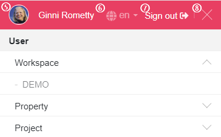

# 제품 소개

McGaudi는 업무 프로세스와 도구 등을 DevOps 관점에서
최적의 조건으로 구성하여 자동화 처리하고, 개발 업무 결재 관리에
대한 부분을 통합적으로 다룸으로써 빠른 개발/빠른 출시를 위한
최적의 솔루션입니다.

DevOps는 하나의 큰 문화이면서, 개발관련 업무 프로세스, 방법론, 도구 등에 관련한 전체의 틀 역할로써 시장의 빠른 변화를 따라가기
위한 최선의 전략 입니다. 따라서 DevOps는 모범사례(Best Practice)를 기반으로 다양한 시도를 통한 최적의 업무프로세스를
구축하고, 관련한 도구를 구성하여 자동화된 시스템을 기반으로 개발 문화를 새롭게 하는 것에 필수적인 요소 입니다.

### 엔터프라이즈 서비스 애플리케이션의 개발 및 검증/배포를 사용자 관점에서 쉽게

체계화된 업무 프로세스를 CI/CD pipeline과 연동하여, 개발 요청부터 배포까지 전체 업무를 하나의 과정으로 관리
Well-made CI/CD pipeline template을 통해 간단한정보 입력만으로도 프로젝트별 업무 프로세스를쉽게생성 및 관리
잘 정리된 업무 프로세스를 기반으로 DevOps 문화와 기술 습득에 도움을 줍니다.

### McGaudi와 함께라면?

- 빠르고 간소화된 결재 프로세스 및 시스템 제공
- CI/CD를 위한 단일화된 화면 제공
- 다양한 관점(개발요청/개발/빌드/검증/배포)의 자동화된 흐름의 시각화
- 모바일 서비스 환경을 기반으로 편리한 Remote office & work가 가능
- QA 자동화를 위한 기반 프로세스 제공
- DevOps 문화 도입을 위한 손쉬운 접근

> **개발 요청에서 처리까지 소요되는 시간**
>
> 

### McGaudi Life Cycle

비즈니스의 요구사항을 단일화된 채널을 통해 처리 할 수 있으므로, 개발 업무 진행에 따른 시스템 구성 등을 시각적으로 확인 할 수 있습니다. 또한, 자동화 처리된 빌드/검수 환경 제공 등을 통해 신속한 검수 및 서비스 반영이 가능하도록 모든 과정을 한 곳에서 관리합니다.


### McWrapper?

McWrapper는 사용자에게 개발 업무 결재 프로 세스를 확인 및 요청/처리 등을 하는 창구 역할을 합니다. 이 해당 창구를 통해 McGaiver의 CI/CD Pipeline를 기반으로 개발/배포 시스템을 자동으로 처리 합니다.

# 용어 설명

### 사용자

| 한국어 | English |
| ------ | ------- |
| 사용자 | User    |

McWrapper에 가입되어 사용하는 사람입니다.

### 로그인

| 한국어 | English |
| ------ | ------- |
| 로그인 | Sign In |

[사용자](#사용자) 계정 인증을 통해 사이트 이용을 시작합니다.

### 로그아웃

| 한국어   | English  |
| -------- | -------- |
| 로그아웃 | Sign Out |

[사용자](#사용자) 계정 정보를 통한 사이트 이용을 종료합니다.

### 그룹

| 한국어 | English |
| ------ | ------- |
| 그룹   | Group   |

[사용자](#사용자)들이 소속된 집단으로써, 특정 [사용자](#사용자)들을 일괄적으로 지정하기 위한 단위입니다.

### 워크스페이스

| 한국어       | English   |
| ------------ | --------- |
| 워크스페이스 | Workspace |

[프로퍼티](#프로퍼티)와 [프로젝트](#프로젝트)가 생성되는 공간으로써, 생성된 모든 콘텐츠는 워크스페이스 단위로 공유됩니다.

### 프로퍼티

| 한국어   | English  |
| -------- | -------- |
| 프로퍼티 | Property |

비즈니스적으로 구분되는 상품이나 자산의 최상의 단위로써, [스토리북](#스토리북)을 통해 업무 요건을 생성 및 관리할 수 있습니다. (ex. 검색, 지도, 카페, 블로그, etc.)

### 프로젝트

| 한국어   | English |
| -------- | ------- |
| 프로젝트 | Project |

개별적인 산출물을 생성하는 소프트웨어 개발의 단위이며, [릴리즈 티켓](#릴리즈 티켓)을 통해 개발 활동과 개발 주기를 관리할 수 있습니다.

### 구성원

| 한국어 | English |
| ------ | ------- |
| 구성원 | Member  |

[그룹](#그룹) 또는 [워크스페이스](#워크스페이스) 등에 소속된 구성원입니다.

### 빌드

| 한국어 | English |
| ------ | ------- |
| 빌드   | Build   |

소스 코드로부터 실행 가능한 소프트웨어로 만듭니다.

### 산출물

| 한국어 | English  |
| ------ | -------- |
| 산출물 | Artifact |

[빌드](#빌드) 된 결과물입니다.

### 요청자

| 한국어 | English   |
| ------ | --------- |
| 요청자 | Requester |

비즈니스 담당자(현업) 또는 Product Owner 등 개발이 필요한 사항들을 요청하는 사람입니다.

### PL

| 한국어 | English |
| ------ | ------- |
| PL     | PL      |

Project Leader. [프로젝트](#프로젝트) 내 개발을 Leading 하고, 설계하는 사람입니다.

### 검수 담당자

| 한국어      | English |
| ----------- | ------- |
| 검수 담당자 | QA      |

Quality Assurance. 개발된 [산출물](#산출물)의 품질 및 테스트를 관리하고 승인하는 역할입니다.

### 배포 담당자

| 한국어      | English  |
| ----------- | -------- |
| 배포 담당자 | Deployer |

검증된 소프트웨어를 실제 운영환경에 [배포](#배포)할지 결정하는 사람입니다.

### 릴리즈

| 한국어 | English |
| ------ | ------- |
| 릴리즈 | Release |

[프로젝트](#프로젝트)를 통해 개발된 소프트웨어 또는 서비스를 공개하는 단위입니다.

### 배포

| 한국어 | English |
| ------ | ------- |
| 배포   | Deploy  |

검증된 [산출물](#산출물)을 실제 운영환경에 반영합니다.

### 롤백

| 한국어 | English  |
| ------ | -------- |
| 롤백   | Rollback |

[배포](#배포)한 [산출물](#산출물)에 대하여 문제가 발생했을 경우 이전 버전으로 되돌리는 작업입니다.

### 업무

| 한국어 | English |
| ------ | ------- |
| 업무   | Task    |

전체 업무를 포괄하는 최상위 단위입니다.

### 티켓

| 한국어 | English |
| ------ | ------- |
| 티켓   | Ticket  |

업무 처리를 위해 요청사항을 담당자에게 전달하고 일련의 처리 과정을 기재하여 처리 과정과 결과를 조회할 수 있도록 정리한 게시물입니다.

### 스토리북

| 한국어   | English   |
| -------- | --------- |
| 스토리북 | StoryBook |

[요청자](#요청자)가 [프로퍼티](#프로퍼티)의 요건에 대한 [유저 스토리](#유저 스토리)를 모아 놓은 업무 단위입니다. (현업의 요건을 모아놓은 업무 단위입니다.)

### 유저 스토리

| 한국어      | English    |
| ----------- | ---------- |
| 유저 스토리 | User Story |

현업의 구체적인 요건 사항이며, [프로퍼티](#프로퍼티)에서 수행해야 하는 기능을 프로퍼티 사용자의 관점에서 상세히 기술한 요구 사항입니다.

### 릴리즈 티켓

| 한국어      | English        |
| ----------- | -------------- |
| 릴리즈 티켓 | Release Ticket |

[릴리즈](#릴리즈) 과정(process) 및 상태를 보여주고, CI/CD 시스템과 연동하는 [티켓](#티켓)입니다.

### 개발 티켓

| 한국어    | English    |
| --------- | ---------- |
| 개발 티켓 | Dev Ticket |

개발 과정(process) 및 상태를 보여주고, 관리하는 [티켓](#티켓)입니다.

### 업무 담당자

| 한국어      | English  |
| ----------- | -------- |
| 업무 담당자 | Assignee |

[스토리북](#스토리북) 또는 [티켓](#티켓)의 진행을 맡아 현재 업무 처리를 수행하고 있는 사용자입니다.

### 참조자

| 한국어 | English |
| ------ | ------- |
| 참조자 | Cc      |

[스토리북](#스토리북) 또는 [티켓](#티켓)의 작성자나 담당자는 아니지만, 진행 상황을 관찰하는 사람입니다.

### 파이프라인

| 한국어     | English  |
| ---------- | -------- |
| 파이프라인 | Pipeline |

CI와 CD가 수행되는 절차를 정의하고 정의된 절차에 맞춰 자동으로 반응하여 개발 생애 주기를 관리하는 단위입니다.

### CI

| 한국어 | English |
| ------ | ------- |
| CI     | CI      |

개발자를 위한 자동화 프로세스인 지속적인 통합(Continuous Integration)을 의미합니다. CI를 성공적으로 구현할 경우 애플리케이션에 대한 새로운 코드 변경 사항이 정기적으로 [빌드](#빌드) 및 테스트 되어 공유 저장소에 병합되므로 여러 명의 개발자가 동시에 애플리케이션 개발과 관련된 코드 작업을 할 경우 서로 충돌할 수 있는 문제를 해결할 수 있습니다.

### CD

| 한국어 | English |
| ------ | ------- |
| CD     | CD      |

지속적인 서비스 제공(Continuous Delivery) 또는 지속적인 배포(Continuous Deployment)를 의미하며 이 두 용어는 상호 교환적으로 사용됩니다. 두 가지 의미 모두 [파이프라인](#파이프라인)의 추가 단계에 대한 자동화를 뜻하지만 때로는 얼마나 많은 자동화가 이루어지고 있는지를 설명하기 위해 별도로 사용되기도 합니다.

### 파이프라인 변수

| 한국어          | English           |
| --------------- | ----------------- |
| 파이프라인 변수 | Pipeline Variable |

패스워드, 인증서 관련 정보 등을 포함한 보안이 필요한 정보입니다.

# 메뉴 설명


- 관리자(Administrator)
  - 그룹 관리(Manage groups): [그룹](#그룹)을 관리하고, [구성원](#구성원)을 추가하거나 제외시킵니다.
  - 권한 관리(manage permissions): 권한에 [그룹](#그룹)을 할당하거나 조회합니다.
  - 사용자 관리(Manage users): [사용자](#사용자)를 관리하고, 조회합니다.
  - 초대 관리(Manage guests): 초대메일을 전송/재전송하고, 초대 정보를 관리합니다.
- 사용자(User)
  - Workspace: [워크스페이스](#워크스페이스) 목록이 출력됩니다. 관리자 권한이 있으면, 우측에 Management 메뉴가 보입니다.
  - Property: [프로퍼티](#프로퍼티) 목록이 출력됩니다. 관리자 권한이 있으면, 우측에 Management 메뉴가 보입니다.
  - Project: [프로젝트](#프로젝트) 목록이 출력됩니다. 관리자 권한이 있으면, 우측에 Management 메뉴가 보입니다.
- 데브옵스(DevOps)
  - Default pipeline variable settings: 자주 사용되는 [파이프라인 변수](#파이프라인 변수)를 관리합니다.
  - Manage pipelines: [파이프라인](#파이프라인)을 관리합니다.
- 상단 메뉴(GNB)
  - Home: 사이트의 메인 페이지로 이동합니다.
  - Notifications: 나에게 도착한 알림 메시지를 조회하고, 클릭하여 관리화면으로 이동하는 인터페이스를 제공합니다.
  - Create ...: 생성 권한이 있는 [워크스페이스](#워크스페이스), [프로퍼티](#프로퍼티), [프로젝트](#프로젝트), [스토리북](#스토리북), [릴리즈 티켓](#릴리즈 티켓)을 생성합니다.
  - Profile: [사용자](#사용자) 정보를 조회하고, 수정합니다.

# 역할 별 사용방법

## 일반 사용자

### 회원 가입

회원 가입은 초대된 이메일 주소로 발송된 링크를 통해서만 할 수 있습니다.

[](./assets/videos/join.mp4)

링크를 클릭하여 페이지 이동 후 원하는 가입 방법을 선택 해 사용자 정보를 입력하시면 됩니다.

### 로그인

McWrapper는 다양한 방식의 로그인을 지원 할 예정입니다.(현재 Google OAuth 2.0을 지원합니다.)

- OAuth 2.0(Google, Github, Facebook, Naver, Kakao 등)
- ID / PW Form 로그인
- LDAP
- ETC...

### 인터페이스


1. 메인 페이지로 이동합니다.
2. 나에게 온 알림의 개수를 보여줍니다.
3. 권한이 있는 스토리북, 릴리즈 티켓 등을 생성합니다.
4. 전체 메뉴를 펼칩니다.



5. 사용자 조회 페이지로 이동합니다.
6. 언어를 변경합니다.
7. 사이트 이용을 종료합니다.
8. 펼쳐진 메뉴를 닫습니다.


9. 이전 페이지로 이동합니다.
10. 메인 페이지로 이동합니다.
11. 페이지의 타이틀이 표시됩니다.
12. 페이지를 리로드 합니다.
13. 옵션 기능이 있는경우 표시됩니다.

## 사이트 관리자(Administrators)

사이트 관리자 권한은 시스템이 설치된 후 첫번째 로그인한 사용자에게 부여됩니다.

[](./assets/videos/administrator_01.mp4)

### 사용자 초대

초대 관리 메뉴에서 이메일 주소를 이용하여 사용자를 초대 할 수 있습니다.

[](./assets/videos/invite_users_01.mp4)

여러 사람을 동시에 초대 할 수 있고, 초대와 동시에 가입 시 소속될 그룹이나 워크스페이스를 미리 지정 할 수도 있습니다.

[](./assets/videos/invite_users_02.mp4)

이미 초대된 사용자에게 초대 메일을 재발송 하거나 초대정보를 삭제 할 수 있습니다.

[](./assets/videos/invite_users_03.mp4)

초대정보가 삭제된 사용자는 메일의 링크를 통해 가입을 시도하더라도 가입이 불가합니다.

### 그룹 관리 & 권한관리

시스템에 미리 정의된 그룹들이 존재합니다. 이 그룹들은 삭제가 불가합니다.

- Administrators: 사이트의 관리자 그룹
- DevOps: DevOps 메뉴에 접근권한을 가지는 그룹
- WorkspaceManagers: [워크스페이스](#워크스페이스) 생성권한을 가지는 그룹
- Users: 사용자들이 속하게 되는 기본 그룹

시스템에서 관리되는 그룹들과 별도로 커스텀 그룹을 만들고, 사용자를 추가 할 수 있습니다.

[](./assets/videos/create_group.mp4)

커스텀 그룹을 통해 쉽고, 빠르게 사용자들의 권한을 관리 할 수 있습니다.


예를들어, DevOps 엔지니어가 아닌 PL의 경우 DevOps 엔지니어들이 만들어 놓은 파이프라인을 조회하여 참고할 필요가 있는데 이때 PL 그룹을 만들고, 해당 사용자들을 추가한 후 DevOps > Pipeline view 권한을 PL 그룹에 부여하면 PL 그룹에 소속된 구성원들은 파이프라인의 조회가 가능 해 집니다.

### 권한 관리
미리 정의되어 있는 권한에 그룹을 연결하여 사용자에게 권한을 부여합니다.

예를들어, DevOps 엔지니어가 아닌 PL의 경우 DevOps 엔지니어들이 만들어 놓은 파이프라인을 조회하여 참고할 필요가 있는데 이때 PL 그룹을 만들고, 해당 사용자들을 추가한 후 DevOps > Pipeline view 권한을 PL 그룹에 부여하면 PL 그룹에 소속된 구성원들은 파이프라인의 조회가 가능 해 집니다.

[](./assets/videos/group_permission.mp4)

## 데브옵스 엔지니어(DevOps Engineers)
+ default credential을 설정할 수 있습니다.
+ 파이프라인을 추가할 수 있습니다.

## 워크스페이스 관리자(Workspace Administrators)
+ 워크스페이스를 생성합니다.
+ 워크스페이스에 멤버를 추가합니다.
+ 프로퍼티 생성 권한자를 PropertyManager 그룹에 추가합니다.
+ 프로젝트 생성 권한자를 ProjectManager 그룹에 추가합니다.
+ QA를 QA Pool 그룹에 추가합니다.
+ 배포자를 Deployer 그룹에 추가합니다.

## 프로퍼티 관리자(Property Managers) 
+ 프로퍼티를 생성합니다.
+ 스토리북의 유저 스토리를 프로젝트에 매핑할 담당자를 DevDesk 그룹에 추가합니다.
+ 프로퍼티에서 스토리북을 생성할 담당자를 Requesters 그룹에 추가합니다.
 
## 프로젝트 관리자(Project Managers)
+ 프로젝트 생성 및 사용할 파이프라인 선택과 프로젝트에서 설정할 credential을 입력한다.
    + credential에 입력할 git private key를 등록해야 되는데 SSH 키가 없다면 새로운 SSH 키 페어를 생성해야 합니다.
      이제 Terminal을 열고 ssh를 만들어 보겠습니다.
      먼저 ssh key를 생성하기 전에 이미 생성된 key가 있는지 확인해 보겠습니다.

        ```
        cd ~/.ssh
        No such file or directory
        ```

      아직 한번도 ssh key를 생성하지 않은 상태입니다.
      ssh key pair를 만들어 보겠습니다.

      새로운 ED25519 SSH 키 쌍을 생성하십시오.

        ```
        ssh-keygen -t ed25519 -C "email@example.com"
        ```

      또는 RSA를 사용하려는 경우 :

        ```
        ssh-keygen -o -t rsa -b 4096 -C "email@example.com"
        ```

      이 -C플래그는 키가 여러 개이고 어느 것이 어떤 것인지 말하려는 경우 키에 주석을 추가합니다. 선택 사항입니다.

        ```
        Enter file in which to save the key (/Users/사용자이름/.ssh/id_ed25519):
        Created directory '/Users/사용자이름/.ssh'.
        ```

      Enter file in which to save the key (/Users/사용자이름/.ssh/id_ed25519): 어디에 key를 만들지 묻습니다. 그냥 엔터를 처서 기본 위치에 기본 파일명으로 만들도록 합니다.
      Enter passphrase (empty for no passphrase):
      Enter same passphrase again: key에 대한 비밀번호를 만들라고 나오는데 보통 그냥 엔터를 처서 넘어갑니다.

      그럼 키가 만들어지고 기본 위치(/Users/사용자이름/.ssh/id_ed25519)에 파일이 생성됩니다.
      이제 생성이 되어 있는지 확인해 봅시다.

        ```
        cd ~/.ssh
        ```

      id_ed25519	id_ed25519.pub가 생성되어 있는 것을 확인할 수 있습니다.
      이제 새로 생성 된 공개 키를 GitLab 계정에 추가 할 차례입니다.

      운영 체제에 따라 아래 명령 중 하나를 사용 하여 공개 SSH 키를 클립 보드에 복사하십시오 .

        ```
        맥 OS:
        pbcopy < ~/.ssh/id_ed25519.pub
        ```

        ```
        WSL / GNU / Linux (xclip 패키지 필요) :
        xclip -sel clip < ~/.ssh/id_ed25519.pub
        ```

        ```
        Windows의 Git Bash :
        cat ~/.ssh/id_ed25519.pub | clip
        ```

      그래픽 편집기에서 키를 열고 여기에서 복사 할 수도 있지만 실수로 아무 것도 변경하지 않도록 주의하십시오.
      에디터에 ctrl+v 하면 복사된 private key 값이 나옵니다.

    + Github, GitLab 계정에 SSH 키 추가
      [Settings] --> [SSH and GPG keys] --> [New SSH key]를 클릭합니다.  
      복사한 private key을 등록합니다.

### Credentials 입력 예(vue)
      

1. git_address(Git 주소)
    ssh://로 시작되는 git 주소를 입력합니다.
2. git_email(Git 계정 이메일 주소)
    Git 계정 이메일 주소를 입력합니다.
3. git_name(Git 계정)
    Git 계정을 입력합니다.
4. git_private_key
    Github, GitLab 계정에 추가된 SSH 키를 복사합니다.

  
[중요](#e83f62) (빨간 색 박스 처리된 부분을 보시면)
- 첫 라인에 | 가 들어가야 되고 
- indent 1번 들어 가야 됩니다.
5. profile_active_dev,  
6. profile_active_prd,  
7. profile_active_stg 는  
각각 development, production, staging을 넣어주면 됩니다. [vue cli 가이드 참고](https://cli.vuejs.org/guide/mode-and-env.html#using-env-variables-in-client-side-code)

+ 프로젝트 등록시 데브옵스 엔지니어가 등록한 파이프라인을 프로젝트에 등록할 수 있습니다.
+ 프로젝트 리더를 PL 역할로 설정합니다.
+ 프로젝트의 개발자들을 Developers 역할로 설정합니다.
+ 워크스페이스의 QA 담당자들 중 프로젝트 전담 QA를 QA 역할로 설정합니다.
+ 워크스페이스의 배포 담당자들 중 프로젝트 전담 배포자를 Deployer 역할로 설정합니다.

## 요청자(Requester)
+ 스토리북을 생성할 수 있습니다.
+ 유저스토리에 프로젝트를 매핑한다.
+ 유저스토리에 매핑된 프로젝트의 릴리즈 티켓을 선택한다.

## PL(Project Leader)
+ 유저스토리에 매핑된 프로젝트의 릴리즈 티켓을 선택할 수 있습니다.
+ 설계를 완료합니다.
+ 개발 브랜치를 생성합니다.
+ 개발을 시작합니다.
+ 개발을 완료합니다.
+ 릴리즈를 완료합니다.

## 개발자(Developers)

## 데브데스트(DevDesk)
+ 유저스토리에 프로젝트를 매핑할 수 있습니다.

## 검수 담당자(Quality Assurance)
+ 스테이징 테스트를 시작합니다.
+ 스테이징 테스트를 완료합니다.

## 배포 담당자(Deployer)
+ 운영환경 배포를 시작합니다.

# Stortbook 사용방법

# Ticket 사용방법
